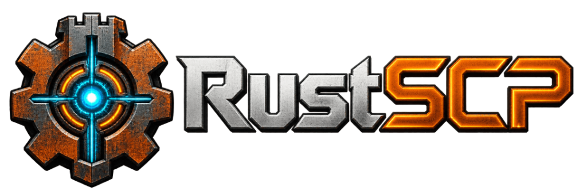
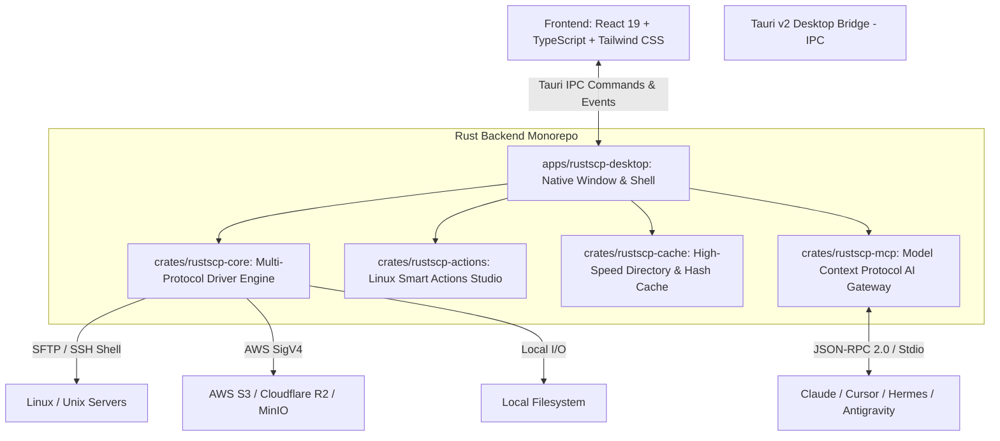

<p align="center">
  
</p>

<p align="center">
  <strong>Next-Gen Remote Workspace, Multi-Protocol SFTP/SCP/S3 Client & AI Gateway (MCP)</strong><br />
  <em>Engineered from the ground up in 100% safe Rust and Tauri v2. The modern, blazing-fast, memory-safe successor to <a href="https://winscp.net/">WinSCP</a>.</em>
</p>

<p align="center">
  <a href="https://github.com/tiagobecker/RustSCP/releases"></a>
  <a href="https://www.rust-lang.org/"></a>
  <a href="https://v2.tauri.app/"></a>
  <a href="https://modelcontextprotocol.io/"></a>
  <a href="https://github.com/tiagobecker/RustSCP/blob/main/LICENSE"></a>
</p>

<p align="center">
  
  
  
</p>

---

## 🌟 Why RustSCP?

For more than two decades, **WinSCP** set the gold standard for dual-pane file management on Windows. However, modern engineering teams work across macOS, Linux, and Windows, deploy to cloud-native object stores (S3, Cloudflare R2, MinIO), and orchestrate infrastructure through **Autonomous AI Agents**.

**RustSCP** reimagines this legacy with modern systems engineering:
- 🚀 **Blazing Native Performance:** Built with pure asynchronous Rust ([Tokio](https://tokio.rs/)) and [Tauri v2](https://v2.tauri.app/). Consumes **under 40 MB of RAM** — eliminating the heavy CPU & memory overhead of Electron.
- 🤖 **Native AI Gateway (Model Context Protocol / MCP):** An audited, sandboxed bastion server allowing LLM agents (Claude Code, Hermes, Antigravity, OpenClaw, Cursor) to safely query, inspect, and manage remote infrastructure without exposing raw credentials or private SSH keys.
- 🛡️ **Guaranteed Memory Safety:** Zero segfaults, zero memory leaks, and resilient concurrency guaranteed by Rust's ownership model.
- ⚡ **Proactive Dual-Session SSH Architecture:** Automatically authenticates an SFTP data channel *and* an interactive remote shell session during initial login. Execute instantaneous Linux commands (`rm -rf`, `sha256sum`, `systemctl`) without extra logins or latency.

---

## 📊 Feature Comparison

| Feature | **RustSCP** 🦀 | **WinSCP** 🪟 | **FileZilla** 📁 | **Cyberduck** 🦆 |
| :--- | :---: | :---: | :---: | :---: |
| **Core Architecture** | **Safe Rust + Tauri v2** | C++ / VCL | C++ / wxWidgets | Java / Cocoa |
| **Memory Footprint** | **~35 - 45 MB** | ~40 - 60 MB | ~80 - 120 MB | ~300 - 500 MB |
| **Native Multiplatform** | **macOS, Windows, Linux** | Windows Only | macOS, Win, Linux | macOS, Windows |
| **AI Agent MCP Gateway** | **Built-in (Native)** | ❌ No | ❌ No | ❌ No |
| **Dual-Pane Commander** | **Yes (Classic & Modern)** | Yes | Split View | ❌ Single Pane |
| **SSH Dual-Session Shell** | **Instant (First Login)** | Re-login required | ❌ No | ❌ No |
| **AWS S3 / R2 / MinIO** | **Native AWS SigV4** | S3 Only | Pro Edition ($) | Yes |
| **Remote Quick-Delete (`rm -rf`)** | **Yes (Safe fallback)** | Scripting only | ❌ Slow file-by-file | ❌ Slow file-by-file |
| **Visual Unix Chmod Studio** | **Real-time Octal Matrix** | Basic | Basic | Basic |
| **Built-in Remote Code Editor** | **Yes (`F4` with live save)** | External / Basic | External only | External only |
| **Smart Context Menu** | **Edge-aware 60 FPS** | Standard | Standard | Standard |

---

## ⚡ Key Highlights & Capabilities

### 🔒 1. Multi-Protocol Engine
- **SFTP (SSH File Transfer Protocol):** Full SSH2 implementation supporting password auth, private keys (`id_rsa`, `id_ed25519`, `.pem`, PuTTY `.ppk`), SSH Agent, and chunked high-throughput parallel streaming.
- **SCP (Secure Copy):** High-speed channel transfer for legacy servers.
- **Amazon S3 & Compatible Clouds:** Native cryptographic **AWS SigV4** engine in HMAC-SHA256. Tested with AWS S3, Cloudflare R2, MinIO, Wasabi, and Backblaze B2.
- **FTP / FTPS:** TLS-encrypted and standard FTP support.
- **Local Filesystem:** Native high-speed local disk operations.

### 🤖 2. Model Context Protocol (MCP) AI Gateway
RustSCP includes an embedded JSON-RPC 2.0 MCP server (`rustscp-mcp`) acting as a secure bastion:
- Enables AI tools (**Claude Code, Hermes, Antigravity, Cursor, OpenClaw**) to list directories, read configuration files, and perform authorized server actions.
- Enforces granular permission controls, human-in-the-loop approvals, and structured audit logs.
- Never reveals raw SSH credentials or root passwords to the AI model.

### 🔄 3. Dual-Session Proactive SSH Architecture
Unlike traditional tools that disconnect or force a second login prompt when running terminal operations:
- RustSCP initializes both the SFTP file subsystem and an authenticated Shell channel on the initial handshake.
- Remote operations like calculating recursive directory sizes (`du -sb`), generating SHA-256 hashes, running system commands, or performing fast directory removals (`rm -rf`) execute instantaneously with zero re-authentication overhead.

### 🖥️ 4. Commander & Explorer Layouts
- **Dual-Pane (Commander Mode):** Fast file movement between Local and Remote (or Remote to Remote) using traditional `Tab`, `F5` (Copy), and `F6` (Move) workflows.
- **Single-Pane (Explorer Mode):** Distraction-free navigation with collapsible folder tree.
- **Multi-Session Tabs:** Open simultaneous connections to multiple servers, clusters, and local drives with automatic reconnection and state recovery.
- **Session Memory:** Remembers the last active remote directory per site/host upon disconnect or app shutdown (configurable in Settings).

### 📝 5. Built-in Remote Code Editor (`F4` / `F3`)
- View (`F3`) and Edit (`F4`) remote server files directly inside the application.
- Syntax highlighting for over 30 languages (Rust, Go, Python, TypeScript, Shell, JSON, YAML, etc.).
- Line numbers, search/replace (`Ctrl+F`), and **instant remote save (`Ctrl+S`)** over the active SFTP stream.

### 🛡️ 6. Visual Unix Permissions (`chmod`) & Hashes
- Comprehensive permissions studio (`Alt+Enter`): visual checkboxes for Owner, Group, and Public (Read, Write, Execute, Sticky Bit) with bidirectional octal translation (`0755`, `0644`, `0777`).
- Integrity verification: compute and compare **SHA-256** and **MD5** hashes remotely or locally with one click.

### 🧭 7. Next-Gen Context Menu & UX
- **Dynamic Viewport Edge Mapping:** The right-click menu detects screen boundaries; flips upwards when near the bottom of the window, and opens submenus to the left when near the right edge.
- **Visual Overflow Indicators:** Animated "More above" and "More below" indicators with smooth auto-scroll on click.
- **Zero-Freeze Guarantee:** Isolated rendering lifecycle with global dismiss listeners (`Escape`, outside click backdrop, window blur).

---

## 🏗️ Architecture

RustSCP is designed as a modular workspace ensuring separation of concerns:



### Crate Breakdown:
- **`crates/rustscp-core`**: Core networking, connection pooling, SFTP/SCP/S3/FTP abstractions, and dual-session SSH manager.
- **`crates/rustscp-actions`**: Linux Smart Actions catalog, parameter validator, safety level engine (*Safe*, *Warning*, *Dangerous*), and script execution runner.
- **`crates/rustscp-cache`**: In-memory and disk caching for directory listings, connection secrets (OS Keychain integration), and file hashes.
- **`crates/rustscp-mcp`**: Model Context Protocol (MCP) server implementation exposing tool definitions and resources to LLM agents.
- **`apps/rustscp-desktop`**: Tauri v2 application wrapper and React 19 single-page UI.

---

## ⌨️ Keyboard Shortcuts

| Action | macOS 🍏 | Windows / Linux 🪟🐧 |
| :--- | :--- | :--- |
| **Switch Panes** | `Tab` | `Tab` |
| **View File** | `F3` | `F3` |
| **Edit File** | `F4` | `F4` |
| **Copy Files** | `F5` | `F5` |
| **Move / Rename** | `F6` | `F6` |
| **New Folder** | `F7` | `F7` |
| **Delete (Move to Trash)** | `⌘ + ⌫` or `F8` | `Delete` or `F8` |
| **Permanent Delete** | `⌥ + ⌘ + ⌫` | `Shift + Delete` or `Shift + F8` |
| **Properties & Chmod** | `Alt + Enter` / `⌘ + I` | `Alt + Enter` |
| **Quick Terminal Command** | `Ctrl + R` | `Ctrl + R` |
| **Navigate Up Directory** | `⌘ + ↑` | `Alt + ↑` |
| **Save in Editor** | `⌘ + S` | `Ctrl + S` |
| **Close Dialog / Menu** | `Escape` | `Escape` |

---

## 🚀 Getting Started & Installation

### Pre-built Binaries
Download the latest pre-compiled binaries from the [Releases](https://github.com/tiagobecker/RustSCP/releases) page:
- **macOS:** `.dmg` installer or `.app` bundle (supports Apple Silicon `aarch64` and Intel `x86_64`).
- **Windows:** `.msi` installer or standalone `.exe`.
- **Linux:** `.AppImage`, `.deb`, or `.tar.gz`.

---

### Building from Source

#### Prerequisites
1. **Rust:** Latest stable toolchain (`rustup update stable`).
2. **Node.js & pnpm:** Node.js 20+ and `pnpm` (`corepack enable pnpm`).
3. **Platform Libraries:**
   - **macOS:** Xcode Command Line Tools (`xcode-select --install`).
   - **Linux (Ubuntu/Debian):**
     ```bash
     sudo apt update && sudo apt install -y libwebkit2gtk-4.1-dev build-essential curl wget file libxdo-dev libssl-dev libayatana-appindicator3-dev librsvg2-dev
     ```
   - **Windows:** C++ Build Tools and WebView2.

#### Build Instructions
```bash
# 1. Clone the repository
git clone https://github.com/tiagobecker/RustSCP.git
cd RustSCP

# 2. Install UI dependencies
pnpm install

# 3. Run in Desktop Development Mode (with Hot Reload)
pnpm desktop:dev

# 4. Build Optimized Production Release
pnpm release

# 5. Create native installers (.dmg, .msi, .deb, etc.)
pnpm bundle
```

---

## 🤝 Contributing

Contributions are warmly welcome! Please check out our [Contributing Guidelines](CONTRIBUTING.md) and [Security Policy](SECURITY.md) before submitting pull requests.

```bash
# Run backend test suite
cargo test --all

# Run linting
cargo clippy --workspace --all-targets -- -D warnings
pnpm --dir apps/rustscp-desktop/ui lint

# Build verification
pnpm build
```

---

## 📜 License

This project is licensed under the **MIT License** - see the [LICENSE](LICENSE) file for details.

Copyright (c) 2026 **Tiago Becker**.

---

<p align="center">
  <sub>Crafted with passion in <strong>Rust</strong> 🦀 for developers and sysadmins worldwide.</sub>
</p>
